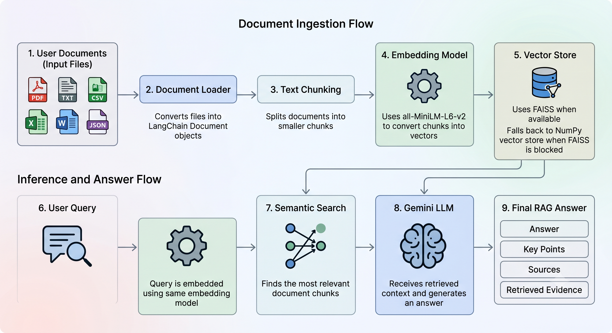
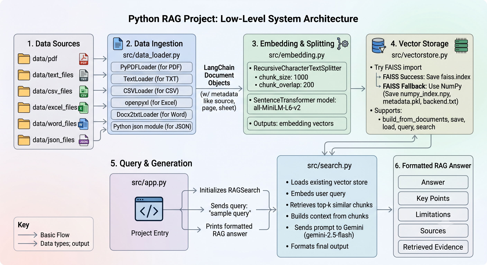

# RAG Project 01

This project is a small Retrieval-Augmented Generation (RAG) system built to learn how documents are loaded, chunked, embedded, stored in a vector index, retrieved by semantic search, and summarized with an LLM.

The knowledge base is focused on **Vision-Language Navigation (VLN)** research. It includes PDFs, text files, CSV tables, Excel sheets, Word notes, and JSON records related to VLN benchmarks, metrics, and research themes.

## What This Project Does

The pipeline follows this flow:

```text
Documents
  -> LangChain Document objects
  -> text chunks
  -> sentence-transformer embeddings
  -> vector store
  -> semantic search
  -> Gemini summary answer
```

At the moment, the app:

- Loads multiple document formats from the `data/` folder.
- Splits documents into smaller chunks.
- Creates embeddings with `all-MiniLM-L6-v2`.
- Stores vectors in a local vector store.
- Falls back to a NumPy vector store if FAISS is blocked by Windows.
- Searches for relevant chunks based on a user query.
- Uses Google Gemini to produce a readable answer.
- Prints a structured RAG response with answer, key points, sources, and retrieved evidence.

## Architecture Diagrams

### High-Level RAG Architecture

This diagram shows the complete RAG workflow at a high level, from multi-format documents to the final Gemini-generated answer.



### Low-Level RAG Architecture

This diagram shows the lower-level implementation details, including the project modules, document loaders, embedding pipeline, vector store, retrieval flow, and answer formatting.



## What I Was Learning

This project helped me understand the core parts of a RAG system:

- How different file types can be converted into LangChain `Document` objects.
- Why chunking is needed before embedding long documents.
- How sentence embeddings represent text as numerical vectors.
- How vector search retrieves semantically similar chunks.
- How retrieved context is passed to an LLM for answer generation.
- Why source metadata is important for checking where an answer came from.
- How dependency and environment issues can affect real AI projects.
- How to handle FAISS problems on Windows by using a fallback vector store.

## Supported File Types

The loader currently supports:

- PDF: `.pdf`
- Text: `.txt`
- CSV: `.csv`
- Excel: `.xlsx`, `.xlsm`
- Word: `.docx`
- JSON: `.json`

The project data includes VLN-related examples such as:

- benchmark summaries
- evaluation metrics
- paper indexes
- long-horizon VLN notes
- object navigation dataset cards
- research paper PDFs

## Project Structure

```text
RAG-project01/
  app.py
  README.md
  pyproject.toml
  requirements.txt
  src/
    data_loader.py
    embedding.py
    vectorstore.py
    search.py
  data/
    pdf/
    text_files/
    csv_files/
    excel_files/
    word_files/
    json_files/
    vector_store/
  faiss_store/
```

## Main Files

### `src/data_loader.py`

Loads all supported files from the `data/` folder.

It converts PDF, TXT, CSV, Excel, Word, and JSON files into LangChain document objects.

### `src/embedding.py`

Splits documents into chunks and creates embeddings using:

```text
all-MiniLM-L6-v2
```

### `src/vectorstore.py`

Stores and searches embeddings.

The original plan was to use FAISS, but Windows blocked the FAISS native DLL on this machine:

```text
Application Control policy has blocked this file
```

To keep the project working, the code now automatically falls back to a NumPy-based vector store.

### `src/search.py`

Loads the vector store, retrieves relevant chunks, sends the context to Gemini, and formats the final answer.

The output includes:

- question
- answer
- key points
- limitations
- sources
- retrieved evidence

### `app.py`

Runs a simple query against the RAG system.

Current example query:

```text
What are the main benchmarks used in vision-language navigation?
```

## Environment Setup

Activate the virtual environment in PowerShell:

```powershell
.\.venv\Scripts\Activate.ps1
```

Then run the app:

```powershell
python app.py
```

If using `uv`, dependencies can be installed with:

```powershell
uv sync
```

or installed from `requirements.txt`:

```powershell
pip install -r requirements.txt
```

## Environment Variables

Create a `.env` file in the project root with:

```text
GOOGLE_API_KEY=your_google_api_key_here
```

The Google API key is used by `langchain-google-genai` to call Gemini.

The current Gemini model used in `src/search.py` is:

```text
gemini-2.5-flash
```

## Rebuild The Vector Store

If new documents are added to the `data/` folder, rebuild the vector store:

```powershell
python -c "from src.data_loader import load_all_documents; from src.vectorstore import FaissVectorStore; docs=load_all_documents('data'); store=FaissVectorStore('faiss_store'); store.build_from_documents(docs)"
```

Then run:

```powershell
python app.py
```

## Example Output

The app prints a structured RAG answer like this:

```text
================ RAG Answer ================

Question:
What are the main benchmarks used in vision-language navigation?

Answer:
...

Key points:
- ...
- ...
- ...

Limitations:
...

Sources:
1. ...
2. ...

Retrieved evidence:
1. distance=... | ...
2. distance=... | ...

============================================
```

## Important Notes

- The Hugging Face warning about unauthenticated requests is not fatal.
- FAISS may be blocked on this Windows machine, so the project uses NumPy fallback automatically.
- The local vector store should be rebuilt after adding or editing documents.
- The quality of answers depends heavily on the retrieved chunks.
- Source metadata makes it easier to debug whether the answer came from the right documents.

## Useful Test Questions

```text
What are the main benchmarks used in vision-language navigation?
```

```text
Which metrics are commonly used to evaluate VLN agents?
```

```text
How is R2R different from REVERIE?
```

```text
Why is long-horizon vision-language navigation difficult?
```

```text
What role does memory play in vision-language navigation agents?
```

## Current Status

The project can load documents, build embeddings, save a local vector store, retrieve relevant chunks, and generate a Gemini-based answer.

Next possible improvements:

- Add an interactive command-line question loop.
- Add a Streamlit or web UI.
- Improve retrieval quality with better chunking.
- Store richer metadata for CSV rows and PDF pages.
- Add citations directly inside the generated answer.
- Compare NumPy search, FAISS, and Chroma.
